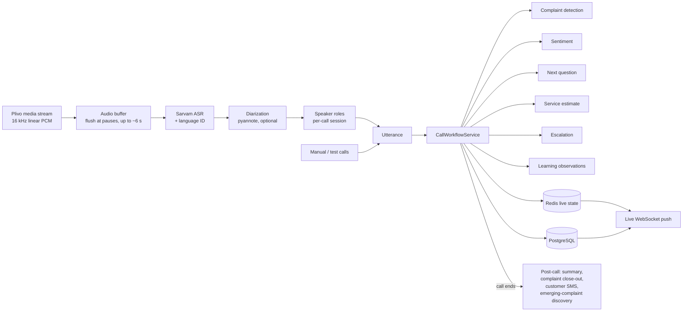
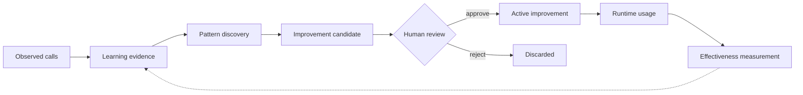
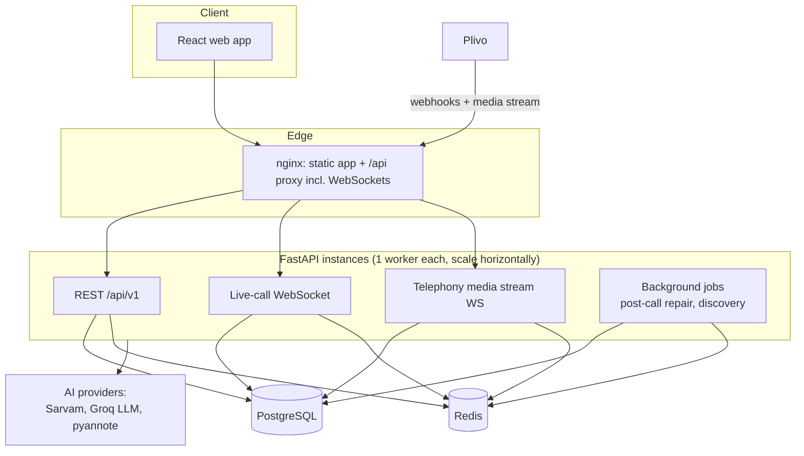

# Multilingual Call Intelligence

Real-time AI assistance for automotive service-centre phone calls. A
customer calls the dealership, and the agent (ICR, *in-call representative*)
sees the conversation transcribed live in the customer's language, the
complaints the customer raises, the customer's tone, the next question
worth asking, an indicative service estimate and an escalation warning.
When the call ends the system writes a post-call summary, tracks every
complaint until it is resolved, looks for new kinds of complaints across
calls, and learns from the agents' corrections under human review.

The backend is FastAPI + PostgreSQL + Redis; the web app is React +
TypeScript. AI capabilities sit behind provider interfaces (Sarvam for
speech, Groq-hosted LLMs for language understanding, local pyannote for
diarization, rule-based fallbacks where they exist).

---

## Contents

- [Problem](#problem) · [Who it is for](#who-it-is-for) · [Key features](#key-features)
- [Call-processing pipeline](#call-processing-pipeline) · [Feature details](#feature-details)
- [Architecture](#architecture) · [Tech stack](#tech-stack) · [Repository structure](#repository-structure)
- [Local setup](#local-setup) · [Running tests](#running-tests) · [Docker](#docker-setup)
- [Production deployment](#production-deployment) · [API](#api-documentation) · [Security](#security-considerations)
- [Limitations](#project-limitations) · [Future improvements](#future-improvements)

## Problem

Service centres in South India take calls in Tamil, Telugu, Kannada,
Malayalam and English, often mixed within one sentence. Agents must catch
every complaint (delays, cost, staff behaviour, parts…), calm unhappy
customers, ask the right follow-up questions and record everything
afterwards. Complaints get missed, unhappy calls are noticed only after the
customer escalates publicly, and recurring problems stay invisible because
nobody reads across calls.

## Who it is for

- **ICR (agent)**: handles the call; needs live guidance and no
  after-call paperwork.
- **Supervisor**: watches escalations, works the complaint queue, reviews
  newly discovered complaint themes and AI improvement candidates.
- **Admin**: manages users and operational tooling (post-call repair).

Roles are enforced by the API (`ICR`, `SUPERVISOR`, `ADMIN`).

## Key features

Implemented:

- Live phone calls through **Plivo** media streams, plus manual calls (typed
  utterances) and a test-audio replay tool for development.
- **Multilingual speech-to-text** and language identification (Sarvam).
- **Speaker diarization** (pyannote, optional) and **speaker roles**
  (agent vs. customer) kept stable across audio chunks.
- **Complaint detection** in 10 categories with per-call coverage tracking.
- **Sentiment / tone** analysis.
- **Next-question suggestions** targeting complaints not yet fully covered.
- **Service cost estimate** from what the customer asks for, priced from the
  service centre's own price list (supervisors upload it from Excel on the
  Price List page; prices per vehicle model, GST added per row).
- **Escalation detection** (rules, optionally plus an LLM) with in-app
  alerts and an acknowledge/resolve workflow.
- **Post-call summary**, complaint close-out, follow-up flags and optional
  SMS summary to the customer.
- **Complaint lifecycle** across calls, with customer history from the CRM
  boundary.
- **Emerging-complaint discovery** across calls, reviewed by supervisors;
  an accepted theme becomes a new complaint category.
- **AI Improvement Center**: a human-in-the-loop learning loop (below).
- Production readiness: JWT auth, role checks, multi-instance live state in
  Redis, migrations, health/readiness probes, Prometheus metrics, structured
  logs, post-call repair job, Docker images.

## Call-processing pipeline



1. **Call start**: Plivo's answer webhook (signature-checked) creates the
   call, identifies the caller through the CRM boundary and returns a stream
   URL carrying a signed, per-call token.
2. **Audio**: the media stream is buffered and flushed in chunks.
3. **Speech**: each chunk is transcribed and its language identified;
   diarization splits speakers and the session role provider maps them to
   ICR/CUSTOMER consistently for the whole call.
4. **Analysis**: each utterance is stored and pushed to the browser as
   soon as it is transcribed. Complaint coverage, sentiment, next question,
   service estimate and escalation then run in the background, at most one
   analysis per call at a time; speech that arrives meanwhile is covered by
   a single follow-up analysis of the whole conversation, so slow or
   rate-limited LLM calls never hold up the transcript or the next audio
   chunk. Coverage and escalations are stored in PostgreSQL; the
   latest sentiment/suggestion/estimate are kept in the shared live state.
5. **Live view**: browsers receive updates over a WebSocket (polling is
   only a fallback).
6. **Call end**: the status webhook (or the agent) completes the call; the
   post-call summary is generated once, complaints are closed out or
   flagged for follow-up, the customer can be sent an SMS summary, and
   emerging-complaint discovery is requested in the background. A repair
   job retries post-call processing that did not finish.

## Feature details

### Multilingual support

Supported languages (`backend/app/core/constants.py`): **Tamil (ta),
English (en), Telugu (te), Kannada (kn), Malayalam (ml)**. Every utterance
carries the languages detected in it, so code-mixed speech is represented.
Sarvam (`saaras:v3` by default) provides transcription and language
identification; other languages returned by the provider are rejected.
Transcription uses Sarvam's `codemix` mode (`SARVAM_STT_MODE`), so English
words in a Tamil sentence stay in English letters ("brake pad மாத்தணும்")
instead of being spelled in Tamil script.

### Speaker identification

Each call has a speaker session (`ROLE_PROVIDER=session`) that holds who is
the ICR and who is the customer. A role, once decided, is locked for the
rest of the call, and the session is shared between instances (Redis).

- **Separate tracks (production).** With `PLIVO_ICR_DIAL_TARGETS` set, the
  answer XML streams both sides of the call (`audioTrack="both"`) and then
  dials the ICR. The caller's track (inbound) is the customer and the other
  track (outbound) is the ICR, so roles are exact and no diarization runs.
  A track that is silent while the other side speaks is not sent to ASR.
- **Mixed audio** (test-audio upload, no ICR dialled). Diarization
  (`DIARIZATION_PROVIDER=pyannote`, model `pyannote/speaker-diarization-community-1`)
  labels speakers per chunk, but those labels change from chunk to chunk.
  A voice tracker therefore matches each chunk's speakers to call-wide
  speakers using voice embeddings (`SPEAKER_MATCH_THRESHOLD`, default
  0.45; `SPEAKER_MAX_PER_CALL`, default 2). What each speaker says is then
  scored for ICR evidence (greetings, offers of help, asking for details)
  or customer evidence ("my car", "I am calling about"), in English and in
  the four native scripts. Add the ICR's own opening lines in
  `ROLE_ICR_PHRASES`. Set `ROLE_LLM_ENABLED=true` to also ask the LLM when
  the phrases leave it open. Speech stays `UNKNOWN` until a role is clear;
  nothing is guessed from who spoke first.

### Complaint detection

An LLM provider classifies customer complaints into the categories below
and the coverage tracker moves each category through
`detected → probed → covered → resolved / unresolved`. After the call,
complaints feed a **complaint lifecycle** (follow-up flags, manual
resolve/unresolved/follow-up with event history) visible on the Complaints
page and in customer history.

**Complaint categories**: Cost, Hygiene, Hospitality, Service Quality,
Turnaround Time, Communication, Parts Availability, Staff Behaviour,
Documentation, Other.

### Sentiment analysis

An LLM provider labels the conversation `POSITIVE`, `NEUTRAL` or
`NEGATIVE` with a confidence and a short evidence quote; it feeds the tone
indicator, escalation and the post-call summary.

### Next-question engine

For complaints that are detected but not fully covered, the next-question
service asks the LLM provider for one question to ask next, with the
target category, priority and reason. Guardrails validate the output. A
rule-based question provider exists in the codebase (used in tests); the
running API uses the LLM provider.

### Escalation

`ESCALATION_PROVIDER=rule_based` detects phrases such as manager requests,
legal threats, public/social-media complaints and cancellations, plus
sustained negative tone and unresolved complaints; `llm` adds an LLM
detector that can only raise the level. Levels are `none`, `watch`, `high`,
`critical`; open escalations appear as in-app alerts that supervisors
acknowledge and resolve.

### Post-call analytics

After completion the system stores a post-call summary (overall summary,
languages, sentiment, complaints with status and evidence, unresolved
issues, promised actions, follow-up flag, customer-facing summary and
service estimate). `SUMMARY_PROVIDER` is `rule_based` or `llm`. The summary
can be sent to the customer by SMS (`sms_gate`, opt-in, consent-aware).
Dashboard and call history show call counts and escalation state.

### Learning / AI Improvement Center

The system improves only through reviewed, reversible changes:



1. **Observed calls**: every AI output on a call (complaint, sentiment,
   question) is recorded as a learning observation.
2. **Learning evidence**: agents and supervisors confirm or correct
   observations (e.g. "wrong category", "question not helpful"); each
   judgement becomes evidence.
3. **Pattern discovery**: evidence is grouped into recurring error patterns,
   filtered for signal quality.
4. **Improvement candidate**: a pattern with enough support becomes a
   candidate with a concrete specification.
5. **Human review**: supervisors approve or reject candidates in the AI
   Improvement Center. Nothing changes without approval.
6. **Active improvement**: approval activates the improvement (it can be
   deactivated later).
7. **Runtime usage**: active improvements are passed as guidance to the
   complaint, sentiment and question providers, and each use is recorded.
8. **Effectiveness measurement**: later evidence on calls that used an
   improvement shows whether it helped.

The AI Improvement Center also hosts emerging-complaint review:
discovery finds themes recurring across calls that match no known
category and supervisors accept or reject them. Accepting a theme makes it
a complaint category: the supervisor names it (up to 40 characters) and
says what counts as it, and from then on complaint detection reports it
on new calls, next questions follow it up, and it appears in the
complaint filters and feedback options. Each API instance picks up a
newly accepted category within `COMPLAINT_CATEGORY_CACHE_SECONDS` (30 s).
Rejecting or reopening the theme stops detection; calls already labelled
keep the category.

## Architecture



### Backend architecture

Layered, with a composition root:

- `app/api/` - FastAPI routers (`v1/`), request/response schemas, auth
  dependencies, and `wiring.py`, which builds every service.
- `app/services/` - application services (call workflow, analysis,
  escalation, complaint lifecycle, learning, post-call, telephony).
- `app/domain/` - immutable domain models and repository interfaces.
- `app/ai/` - provider interfaces and adapters per capability (ASR,
  language, speaker, complaint, sentiment, question, summary, escalation,
  emerging complaint, LLM client).
- `app/infrastructure/` - SQLAlchemy models/repositories and the Redis client.
- `app/composition/` - provider/repository factories chosen by settings.
- `app/telephony/`, `app/crm/`, `app/messaging/`, `app/estimation/` -
  external boundaries (Plivo, CRM lookup, SMS gateway, pricing rules).
- `app/observability/` - logging, request IDs, Prometheus metrics.

Tests use in-memory repositories; `main.py` swaps in PostgreSQL.

### Frontend architecture

React 19 + TypeScript + Vite + React Router, organised by feature
(`src/app/features/<feature>/{components,hooks,services,adapters,types}`):
DTOs from the API are mapped to view models before rendering. Pages:
Dashboard, Live Call, Call History, Post-Call Analysis, Complaints,
Escalations, AI Improvement Center, Administration. The live-call view
connects a WebSocket for pushed updates and polls only as a fallback
(every 2.5 s while the socket is down, every 30 s as a safety net while it
is healthy), reconnecting with exponential backoff and jitter.

### Redis usage

Redis holds only short-lived state shared between API instances
(`LIVE_STATE_STORE_PROVIDER=redis`):

- each active call's latest live analysis (sentiment, next-question
  suggestion, service estimate) and a revision used to push updates;
  expires after `LIVE_ANALYSIS_TTL_SECONDS` without speech;
- open telephony streams and per-call speaker-role sessions;
- background job locks (post-call repair, emerging-complaint discovery)
  and the last discovery run;
- single-use markers for live-call WebSocket tickets;
- the Plivo call-id mapping (`CALL_MAPPING_STORE_PROVIDER=redis`);
- optionally complaint coverage (`COVERAGE_STORE_PROVIDER=redis`).

Transcripts and audio are never stored in Redis. With one instance,
everything can stay in memory (`in_memory`).

### PostgreSQL usage

PostgreSQL is the source of truth: users, calls and utterances, complaint
coverage, complaint lifecycle and events, escalations, post-call summaries,
customer summary deliveries, caller/customer links, emerging-complaint
candidates and all learning data (observations, feedback, evidence,
candidates, active improvements, usage). Schema changes are Alembic
migrations (`backend/alembic/versions`).

### AI provider abstraction

Each capability has an abstract provider (`app/ai/<capability>/provider.py`)
and adapters selected by configuration in `app/composition/providers.py`:

| Capability | Setting | Providers |
|---|---|---|
| LLM client | `LLM_PROVIDER` | `groq` |
| Speech-to-text | `ASR_PROVIDER` | `sarvam` |
| Language ID | `LANGUAGE_PROVIDER` | `sarvam` |
| Diarization | `DIARIZATION_PROVIDER` | `pyannote`, `scripted` |
| Speaker roles | `ROLE_PROVIDER` | `session` (default), `static` (tests) |
| Complaint, sentiment, next question | (LLM) | LLM providers using `LLM_PROVIDER` |
| Service estimate | `ESTIMATION_PROVIDER` | `llm` (default, keyword fallback), `rule_based` |
| Post-call summary | `SUMMARY_PROVIDER` | `rule_based`, `llm` |
| Escalation | `ESCALATION_PROVIDER` | `rule_based`, `llm` (hybrid) |
| Emerging complaints | `EMERGING_COMPLAINT_PROVIDER` | `rule_based`, `llm` |
| Telephony | `TELEPHONY_PROVIDER` | `plivo` |
| CRM | `CRM_PROVIDER` | `none`, `json_file` |
| Customer SMS | `CUSTOMER_SUMMARY_DELIVERY_PROVIDER` | `disabled`, `noop`, `sms_gate` |

## Tech stack

- **Backend**: Python 3.12, FastAPI, Starlette WebSockets, Pydantic,
  SQLAlchemy 2, Alembic, psycopg 3, redis-py, PyJWT, passlib/bcrypt, httpx,
  Groq SDK; optional pyannote.audio + PyTorch.
- **Frontend**: React 19, TypeScript, Vite, React Router, ESLint.
- **Data**: PostgreSQL 16, Redis 7.
- **Infra**: Docker, Docker Compose, nginx, GitHub Actions, Prometheus
  metrics endpoint.

## Repository structure

```
.
├── backend/
│   ├── app/                      # application code (see Backend architecture)
│   ├── alembic/                  # database migrations
│   ├── tests/                    # pytest suite
│   ├── scripts/                  # pipeline / smoke-test scripts
│   ├── data/crm_sample.json      # sample CRM data for CRM_PROVIDER=json_file
│   ├── main.py                   # production entrypoint (PostgreSQL wiring)
│   ├── requirements-api.txt      # API runtime dependencies
│   ├── requirements-dev.txt      # + test tools
│   ├── requirements-diarization.txt  # optional pyannote/torch stack
│   └── Dockerfile
├── frontend/                     # React + TypeScript web app (+ nginx Dockerfile)
├── deploy/
│   ├── docker-compose.prod.yml   # production stack
│   └── .env.production.example   # production settings template
├── docker-compose.yml            # local development database + Redis
├── .env.example                  # local development settings template
├── requirements.txt              # convenience: everything incl. diarization
├── DEPLOYMENT.md                 # production operations guide
└── .github/workflows/ci.yml      # CI
```

## Local setup

Prerequisites: Python **3.12** (3.13 removed `audioop`, used by the
telephony audio path), Node.js 22+, Docker. On Windows, run the backend in
WSL (Ubuntu); ffmpeg is only needed for some audio scripts.

### Environment variables

```bash
cp .env.example .env
```

Fill in at least `GROQ_API_KEY` and `SARVAM_API_KEY`. The backend reads
`.env` from the repository root; every setting and its default is in
`backend/app/core/config.py`. Important groups:

| Variables | Purpose |
|---|---|
| `LLM_PROVIDER`, `GROQ_API_KEY`, `GROQ_MODEL` | LLM for complaints, sentiment, questions |
| `ASR_PROVIDER`, `LANGUAGE_PROVIDER`, `SARVAM_API_KEY` | speech and language |
| `DIARIZATION_PROVIDER`, `HUGGINGFACE_TOKEN`, `ROLE_PROVIDER` | speakers |
| `DATABASE_URL` | PostgreSQL connection |
| `REDIS_URL`, `LIVE_STATE_STORE_PROVIDER`, `CALL_MAPPING_STORE_PROVIDER` | shared live state |
| `AUTH_SECRET_KEY`, `AUTH_ACCESS_TOKEN_EXPIRE_MINUTES`, `BOOTSTRAP_ADMIN_*` | auth |
| `PLIVO_*`, `TELEPHONY_STREAM_*` | telephony |
| `CUSTOMER_SUMMARY_*`, `SMS_GATE_*` | customer SMS |
| `EMERGING_COMPLAINT_*`, `POST_CALL_REPAIR_*` | background work |

Never commit `.env`; only `.env.example` (placeholders) is tracked.

### Database setup

```bash
docker compose up -d postgres
```

The local compose file is for development only; its default credentials
(`postgres` / `password`) match `.env.example` and can be overridden with
`POSTGRES_USER`, `POSTGRES_PASSWORD`, `POSTGRES_DB`.

### Running the backend

```bash
cd backend
python3.12 -m venv .venv
source .venv/bin/activate
pip install -r requirements-dev.txt
# optional, large: local speaker diarization
pip install -r requirements-diarization.txt
alembic upgrade head
python main.py
```

The API listens on `http://localhost:8000`. Create the first user with
`BOOTSTRAP_ADMIN_EMAIL`/`BOOTSTRAP_ADMIN_PASSWORD` or:

```bash
python -m app.cli create-user --email you@example.com --role ADMIN
```

### Running the frontend

```bash
cd frontend
npm ci
npm run dev
```

The app runs on `http://localhost:5173` and calls the API at
`VITE_API_BASE_URL` (default `http://localhost:8000`).

## Running tests

```bash
cd backend && python -m pytest
cd frontend && npm run lint && npm run build
```

The backend suite needs only `requirements-dev.txt`; diarization tests fake
the ML stack. The frontend has no unit-test runner yet; lint and the
TypeScript build are its checks. CI (`.github/workflows/ci.yml`) runs the
backend tests, a compile/import check, frontend lint and build, and
validates both compose files on every push and pull request.

## Docker setup

- `backend/Dockerfile` - API image (`requirements-api.txt`; add the
  diarization stack with `--build-arg INSTALL_DIARIZATION=true`). Runs
  migrations on start, one uvicorn worker, non-root user, health check.
- `frontend/Dockerfile` - builds the app and serves it with nginx, which
  proxies `/api` (including WebSockets) to the backend.
- `docker-compose.yml` - local PostgreSQL and Redis only.

## Production deployment

```bash
cp deploy/.env.production.example deploy/.env.production   # replace every placeholder
docker compose -f deploy/docker-compose.prod.yml --env-file deploy/.env.production up -d --build
```

Put a TLS-terminating proxy in front of the `web` service. With
`APP_ENV=production` the API refuses to start on unsafe settings. See
[DEPLOYMENT.md](DEPLOYMENT.md) for Plivo setup, scaling, post-call repair,
monitoring and backups.

## API documentation

With the backend running, interactive OpenAPI docs are at
`http://localhost:8000/docs` (ReDoc at `/redoc`). Main groups, all under
`/api/v1` unless noted:

| Area | Endpoints |
|---|---|
| Auth | `POST /auth/login` |
| Calls | `GET/POST /calls`, `GET /calls/{id}`, `POST /calls/{id}/utterances`, `GET /calls/{id}/analysis`, `POST /calls/{id}/complete`, `GET /call-stats`, customer and summary-delivery endpoints |
| Live | `POST /calls/{id}/live-token`, `WS /calls/{id}/live?ticket=…` |
| Telephony | `POST /telephony/plivo/answer`, `POST /telephony/plivo/status`, `WS /calls/{id}/telephony-stream?token=…` |
| Complaints | `/complaints`, `/calls/{id}/complaints`, `/emerging-complaints` (+ `/discover`, `/{id}/review`) |
| Escalations | `GET /escalations`, `POST /escalations/{call_id}/acknowledge`, `/resolve` |
| Learning | `/learning/candidates` (+ approve/reject), `/learning/patterns`, `/learning/evidence`, `/learning/calls/{id}/observations`, `/learning/calls/{id}/feedback`, `/learning/improvements` |
| Admin | `/admin/users`, `/admin/post-call` (+ repair/retry) |
| Test calls | `/test-calls` (disabled in production) |
| Ops (no prefix) | `/health/live`, `/health/ready`, `/metrics` |

## Security considerations

- JWT bearer authentication on every REST endpoint; roles checked on
  supervisor/admin actions; inactive users are refused.
- Browser WebSockets never carry the access token: they use a 60-second,
  single-use ticket bound to the user and the call. Purpose-bound tokens
  (WebSocket tickets, telephony stream tokens) are refused as access tokens.
- Plivo webhooks are signature-checked; each media stream needs a signed
  per-call token.
- `APP_ENV=production` refuses weak secrets, wildcard CORS, missing
  signature checks and unsafe store combinations.
- Secrets live only in untracked `.env` / `deploy/.env.production`.
- Containers run as non-root; `/metrics` can require `METRICS_TOKEN` and
  is not exposed through nginx.
- Customer SMS is opt-in and consent-aware.

## Project limitations

- Provider coverage is narrow: one LLM vendor (Groq), one speech vendor
  (Sarvam), one telephony provider (Plivo), and only a JSON-file CRM
  adapter (no real CRM integration yet).
- Complaint detection, sentiment and next-question generation depend on
  the LLM being configured and available (rate limits on free tiers are
  the usual bottleneck).
- Local diarization on CPU is slow; the first call after a restart waits
  for the model to load.
- Accepted emerging-complaint themes are not yet turned into detectable
  categories automatically.
- WhatsApp delivery falls back to SMS; there is no WhatsApp provider.
- The frontend has no automated unit tests yet.

## Future improvements

Not implemented today:

- Real CRM adapters and a dealer-specific pricing source.
- Promoting accepted emerging themes into the complaint taxonomy.
- Additional LLM/ASR providers and a WhatsApp provider.
- GPU or hosted diarization for lower latency.
- Frontend unit/integration tests (e.g. Vitest + Testing Library).
- Redis pub/sub for live updates instead of revision polling, and
  reporting dashboards over the stored analytics.
